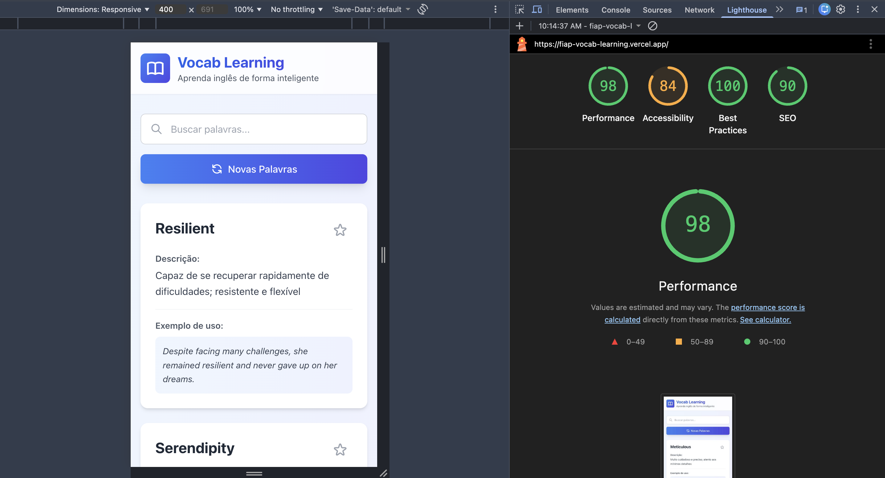

# Vocab Learning App

Uma aplicação web moderna para aprender inglês e expandir seu vocabulário, desenvolvida para a disciplina de Front-end Engineering da FIAP.

---

## 📑 Índice

- [🎯 Objetivo](#-objetivo)
- [🚀 Stack Utilizada](#-stack-utilizada)
- [✨ Funcionalidades](#-funcionalidades)
- [📋 Pré-requisitos](#-pré-requisitos)
- [🔧 Como Executar Localmente](#-como-executar-localmente)
- [🏗️ Build para Produção](#️-build-para-produção)
- [🌐 Deploy](#-deploy)
  - [Vercel](#vercel-recomendado)
  - [Netlify](#netlify)
  - [Render](#render)
- [👥 Integrantes](#-integrantes)
- [🔗 Links do Projeto](#-links-do-projeto)
- [📸 Lighthouse Metrics](#-lighthouse-metrics)
- [📊 Requisitos Atendidos](#-requisitos-atendidos)
- [📄 Licença](#-licença)

---

## 🎯 Objetivo

Este projeto consome uma API BFF (Backend For Frontend) que retorna palavras em inglês com suas descrições e exemplos de uso, apresentando-as de forma visual e interativa para auxiliar no estudo de inglês.

## 🚀 Stack Utilizada

- **Vue.js 3** - Framework JavaScript progressivo
- **Vite** - Build tool e dev server
- **Tailwind CSS** - Framework CSS utilitário
- **Axios** - Cliente HTTP para requisições
- **PostCSS** - Processador CSS
- **Autoprefixer** - Plugin PostCSS para compatibilidade de navegadores

## ✨ Funcionalidades

- ✅ Carregamento de palavras via API BFF
- ✅ Interface moderna e responsiva
- ✅ Sistema de busca em tempo real
- ✅ Animações e transições suaves
- ✅ Modo favoritos para marcar palavras importantes
- ✅ Design adaptativo para mobile, tablet e desktop
- ✅ Feedback visual de loading e erros
- ✅ Gradientes e efeitos visuais modernos

## 📋 Pré-requisitos

- Node.js 16+ instalado
- npm ou yarn como gerenciador de pacotes

## 🔧 Como Executar Localmente

1. **Clone o repositório**
```bash
git clone https://github.com/matheusassumpcao/fiap-vocab-learning.git
cd fiap-vocab-learning
```

2. **Instale as dependências**
```bash
npm install
```

3. **Execute o servidor de desenvolvimento**
```bash
npm run dev
```

4. **Acesse no navegador**
```
http://localhost:5173
```

> **Nota**: O projeto está configurado para usar o BFF em produção (https://fiap-vocab-learning.onrender.com/ask). Para desenvolvimento local do BFF, consulte o [README do BFF](./bff/README.md).

## 🏗️ Build para Produção

Para criar uma versão otimizada para produção:

```bash
npm run build
```

Os arquivos otimizados serão gerados na pasta `dist/`.

Para testar o build localmente:

```bash
npm run preview
```

## 🌐 Deploy

### Vercel (Recomendado)

1. Faça login no [Vercel](https://vercel.com)
2. Clique em "New Project"
3. Importe seu repositório do GitHub
4. Configure:
   - **Framework Preset**: Vite
   - **Build Command**: `npm run build`
   - **Output Directory**: `dist`
5. Clique em "Deploy"

### Netlify

1. Faça login no [Netlify](https://netlify.com)
2. Clique em "Add new site" > "Import an existing project"
3. Conecte seu repositório do GitHub
4. Configure:
   - **Build command**: `npm run build`
   - **Publish directory**: `dist`
5. Clique em "Deploy site"

### Render

1. Faça login no [Render](https://render.com)
2. Clique em "New" > "Static Site"
3. Conecte seu repositório do GitHub
4. Configure:
   - **Build Command**: `npm run build`
   - **Publish Directory**: `dist`
5. Clique em "Create Static Site"

---

## 👥 Integrantes

- **Matheus Assumpção** - RM 362155
- **João Pedro Fonseca de Siqueira** - RM 361693
- **Bruno Vinicius Roger** - RM 363634
- **Maury Reis Viana** - RM 362053

## 🔗 Links do Projeto

### Aplicação Frontend
- **Repositório GitHub**: https://github.com/matheusassumpcao/fiap-vocab-learning
- **Site em Produção**: https://fiap-vocab-learning.vercel.app/

### BFF (Backend)
- **Repositório**: https://github.com/matheusassumpcao/fiap-vocab-learning/tree/main/bff
- **API em Produção**: https://fiap-vocab-learning.onrender.com/ask

## 📸 Lighthouse Metrics

### Desktop Performance


### Mobile Performance


### Explicação das Métricas

As métricas do Lighthouse são indicadores importantes de performance e qualidade do site:

- **Performance (0-100)**: Velocidade de carregamento e responsividade
- **Accessibility (0-100)**: Acessibilidade para usuários com deficiências
- **Best Practices (0-100)**: Boas práticas de desenvolvimento web
- **SEO (0-100)**: Otimização para motores de busca

**Core Web Vitals:**
- **LCP (Largest Contentful Paint)**: Tempo até o maior elemento ser carregado (ideal: < 2.5s)
- **CLS (Cumulative Layout Shift)**: Estabilidade visual durante carregamento (ideal: < 0.1)
- **TBT (Total Blocking Time)**: Tempo que a página fica bloqueada para interação (ideal: < 200ms)

## 📊 Requisitos Atendidos

### Para Nota 7 (Base)
- [x] ✅ Projeto Vue.js funcional consumindo o BFF
- [x] ✅ Interface moderna e responsiva com Tailwind CSS
- [x] ✅ Código publicado no GitHub em repositório público
- [x] ✅ Deploy realizado em ambiente de produção (Vercel)

### Para Nota 10 (Completo)
- [x] ✅ **+1 ponto**: README estruturado explicando finalidade, stack, execução e deploy
- [x] ✅ **+1 ponto**: BFF próprio deployado no Render com 40 palavras embaralhadas
- [x] ✅ **+1 ponto**: Métricas do Lighthouse documentadas com screenshots e explicações

## 📄 Licença

Este projeto foi desenvolvido para fins educacionais como parte da disciplina de Front-end Engineering da FIAP.

---

Desenvolvido com ❤️ para FIAP - 2026
